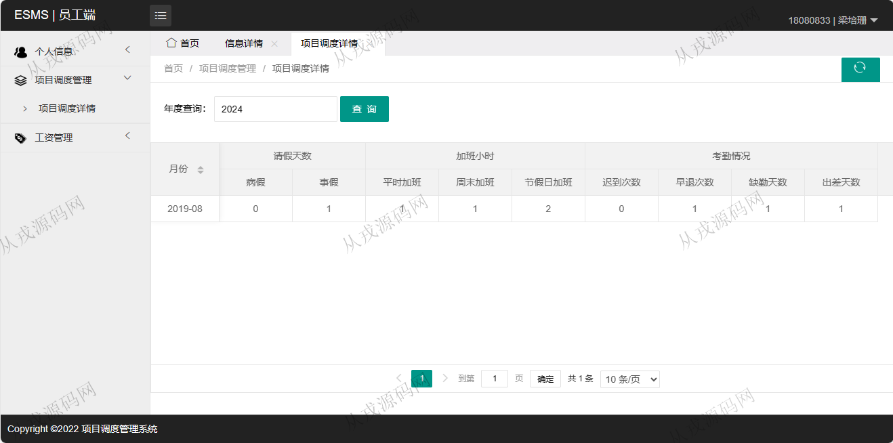
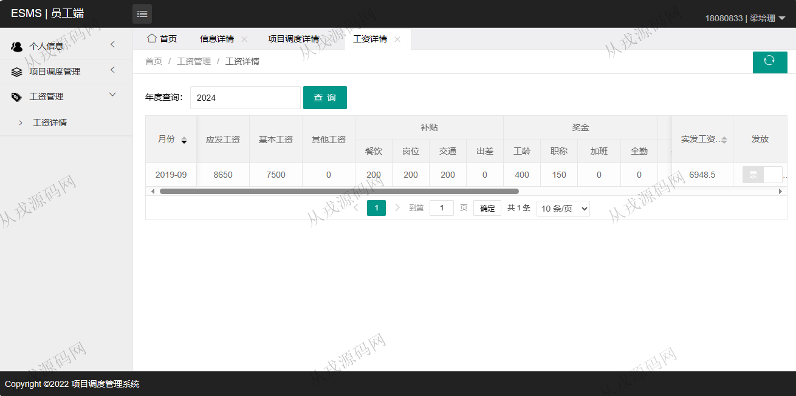
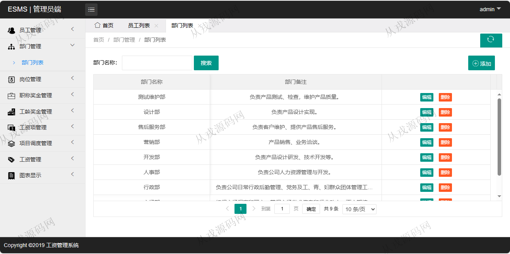
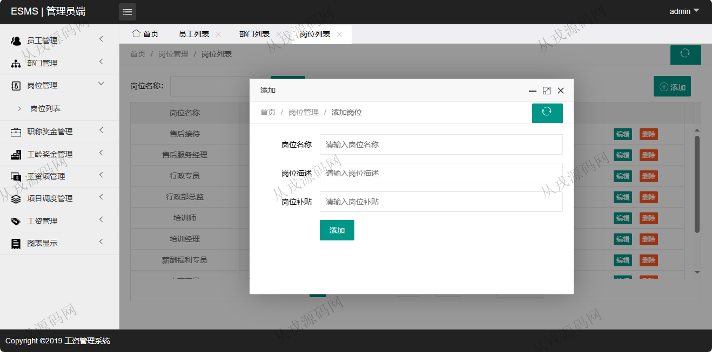
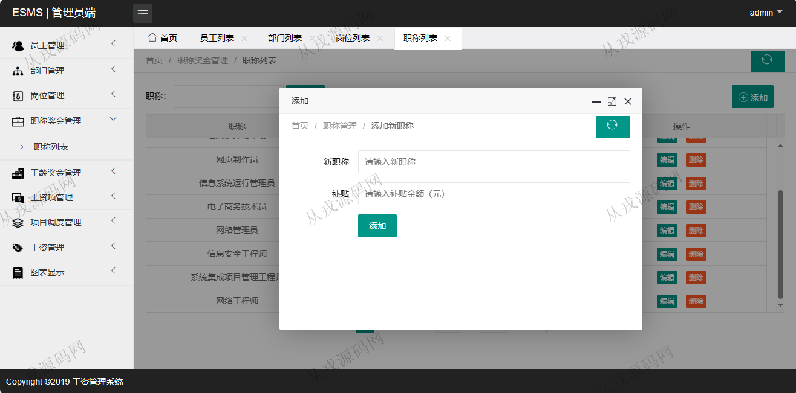
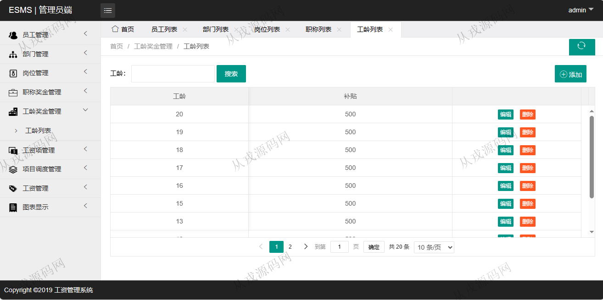
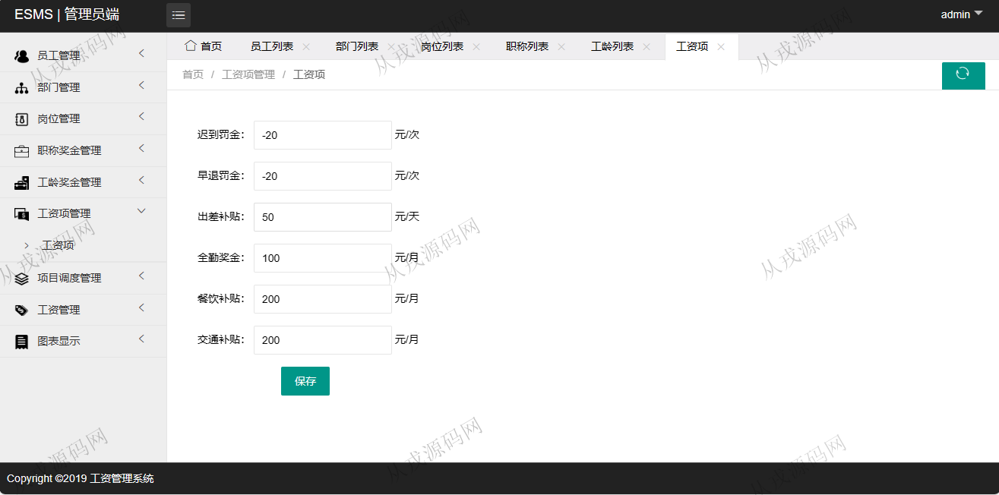
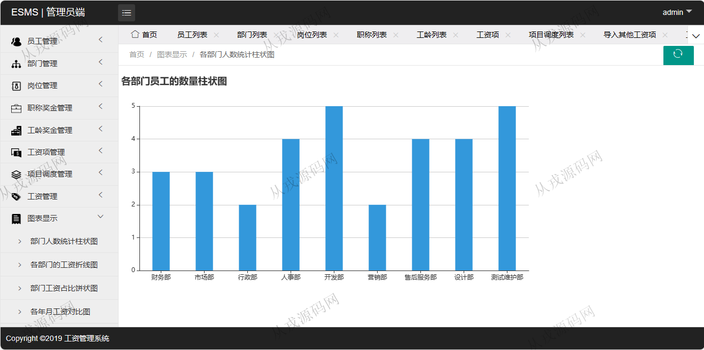

<h1 align="center">149.项目调度管理系统</h1>

- <b>完整代码获取地址：从戎源码网 ([https://armycodes.com/](https://armycodes.com/))</b>
- <b>技术探讨、资料分享，请加QQ群：692619798</b> 
- <b>作者微信：19941326836  QQ：952045282</b> 
- <b>承接计算机毕业设计、Java毕业设计、Python毕业设计、深度学习、机器学习</b>
- <b>选题+开题报告+任务书+程序定制+安装调试+论文+答辩ppt 一条龙服务</b>
- <b>所有选题地址 ([https://github.com/YuLin-Coder/AllProjectCatalog](https://github.com/YuLin-Coder/AllProjectCatalog)) </b>

## 项目介绍
基于ssm的项目调度管理系统：前端 html、jquery、bootstrap，后端 maven、springmvc、spring、mybatis；角色分为：管理员、员工；集成员工管理、职称奖金管理、项目调度管理等功能于一体的系统。

## 功能介绍

- 员工管理：员工信息的增删改查，头像上传，批量删除
- 部门管理：部门信息的增删改查，按部门名称模糊搜索
- 岗位管理：岗位信息的增删改查，按岗位名称模糊搜索
- 职称奖金管理：职称信息的增删改查，职称对应补贴金额
- 工龄奖金管理：工龄信息的增删改查
- 工资项管理：工资项奖金设置
- 项目调度管理：导入项目调度记录，项目调度记录列表查询，编辑和删除
- 工资管理：导入其他工资项，工资结算，工资发放，工资查询
- 图表显示：部门人数统计柱状图，各部门的工资折线图，部门工资占比饼状图，各年月工资对比图

## 环境

- <b>IntelliJ IDEA 2021.3</b>

- <b>Mysql 5.7.26</b>

- <b>Tomcat 7.0.73</b>

- <b>JDK 1.8</b>

## 运行截图

